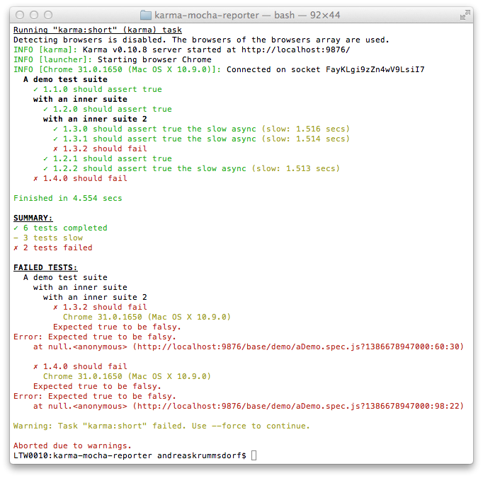

# karma-mocha-reporter

> Karma reporter plugin with mocha style logging.

> [](http://badge.fury.io/js/karma-mocha-reporter)
[](https://travis-ci.org/litixsoft/karma-mocha-reporter)
[](https://david-dm.org/litixsoft/karma-mocha-reporter/)
[](https://david-dm.org/litixsoft/karma-mocha-reporter#info=devDependencies&view=table)

## How does it look like


## Installation
The easiest way is to keep `karma-mocha-reporter` as a devDependency in your `package.json`.
```json
{
  "devDependencies": {
    "karma": "^0.12",
    "karma-mocha-reporter": "^0.2.0"
  }
}
```

You can simple do it by:

    $ npm install karma-mocha-reporter --save-dev

## Configuration
```js
// karma.conf.js
module.exports = function(config) {
  config.set({
    frameworks: ['jasmine'],

    // reporters configuration
    reporters: ['mocha'],

    plugins: [
      'karma-jasmine',
      'karma-mocha-reporter'
    ]
  });
};
```

## Contributing
In lieu of a formal styleguide take care to maintain the existing coding style. Lint and test your code using [grunt](http://gruntjs.com/).

You can preview your changes by running:

    $ grunt demo --force

## Release History
### v0.2.8
* add module log-symbols for printing symbols to the console

### v0.2.7
* report totalTime and netTime the same way "dots" and "progress" reporters do

### v0.2.6
* don't crash when the name of the describe or it block is a reserved object property (e.g. constructor, toString)

### v0.2.5
* results summary is now also printed when all tests fail

### v0.2.4
* better browser names formatting
* fix calculating describe items' success
* use karma's error formatter

### v0.2.3
* fix missing test results when singleRun = true

### v0.2.2
* fix that skipped test where reported as failure

### v0.2.1
* make reporter compatible with karma 0.11

### v0.2.0
* replace dependency color.js with chalk.js

### v0.1.0
* first release

## Author
[Litixsoft GmbH](http://www.litixsoft.de)

## License
Copyright (C) 2013-2014 Litixsoft GmbH <info@litixsoft.de>
Licensed under the MIT license.

Permission is hereby granted, free of charge, to any person obtaining a copy
of this software and associated documentation files (the "Software"), to deal
in the Software without restriction, including without limitation the rights
to use, copy, modify, merge, publish, distribute, sublicense, and/or sell
copies of the Software, and to permit persons to whom the Software is
furnished to do so, subject to the following conditions:

The above copyright notice and this permission notice shall be included i
all copies or substantial portions of the Software.

THE SOFTWARE IS PROVIDED "AS IS", WITHOUT WARRANTY OF ANY KIND, EXPRESS OR
IMPLIED, INCLUDING BUT NOT LIMITED TO THE WARRANTIES OF MERCHANTABILITY,
FITNESS FOR A PARTICULAR PURPOSE AND NONINFRINGEMENT. IN NO EVENT SHALL THE
AUTHORS OR COPYRIGHT HOLDERS BE LIABLE FOR ANY CLAIM, DAMAGES OR OTHER
LIABILITY, WHETHER IN AN ACTION OF CONTRACT, TORT OR OTHERWISE, ARISING FROM,
OUT OF OR IN CONNECTION WITH THE SOFTWARE OR THE USE OR OTHER DEALINGS IN
THE SOFTWARE.